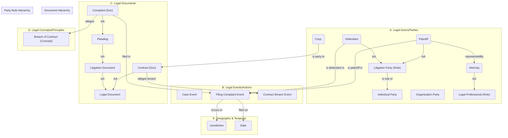

```mermaid
graph TD
    %% === Nodes (Entities) ===

    subgraph "A. Legal Actors/Parties"
        direction LR
        Individual_Party["Individual Party"]
        Plaintiff(Plaintiff)
        Defendant(Defendant)
        Attorney(Attorney)
        Organization_Party["Organization Party"]
        Corporation(Corp.)
        Litigation_Party["Litigation Party (Role)"]
        Legal_Professional["Legal Professional (Role)"]
    end

    subgraph "B. Legal Events/Actions"
        direction LR
        Case_Event["Case Event"]
        Filing_Complaint_Event["Filing Complaint Event"]
        Contract_Breach_Event["Contract Breach Event"]
    end

    subgraph "C. Legal Documents"
        direction LR
        Legal_Doc["Legal Document"]
        Litigation_Doc["Litigation Document"]
        Pleading_Doc["Pleading"]
        Complaint_Doc["Complaint (Doc)"]
        Contract_Doc["Contract (Doc)"]
    end

    subgraph "D. Legal Concepts/Principles"
        direction LR
        Breach_Of_Contract_Concept["Breach of Contract (Concept)"]
    end

    subgraph "E. Geographic & Temporal"
        direction LR
        Jurisdiction(Jurisdiction)
        Event_Date["Date"]
    end

    %% === Relationships (Edges) ===

    Plaintiff -- "is plaintiff in" --> Filing_Complaint_Event
    Defendant -- "is defendant in" --> Filing_Complaint_Event
    Plaintiff -- "representedBy" --> Attorney
    Corporation -- "is party to" --> Contract_Doc
    Contract_Doc -- "alleges breach" --> Contract_Breach_Event
    Filing_Complaint_Event -- "filed on" --> Event_Date
    Complaint_Doc -- "filed in" --> Filing_Complaint_Event
    Complaint_Doc -- "alleges" --> Breach_Of_Contract_Concept
    Filing_Complaint_Event -- "occurs in" --> Jurisdiction

    %% === Hierarchies (isA / subTypeOf) ===

    subgraph "Document Hierarchy"
        direction TD
        Complaint_Doc
        Complaint_Doc -- "isA" --> Pleading_Doc
        Pleading_Doc -- "isA" --> Litigation_Doc
        Contract_Doc -- "isA" --> Legal_Doc
        Litigation_Doc -- "isA" --> Legal_Doc
    end

    subgraph "Party Role Hierarchy"
        direction TD
        Plaintiff -- "isA" --> Litigation_Party
        Defendant -- "isA" --> Litigation_Party
        Litigation_Party -- "is role of" --> Individual_Party
        Attorney -- "isA" --> Legal_Professional
    end
```
